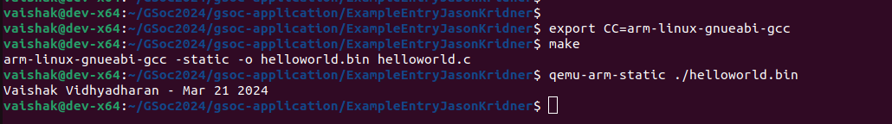

# README

## Introduction

Submission for GSoC 2024 BeagleBoard.org contributor application.

Commited the modified source code and the screenshot of binary executions.

## Steps to build and run the application:

- export CC=arm-linux-gnueabi-gcc
- make
- qemu-arm-static ./helloworld.bin

