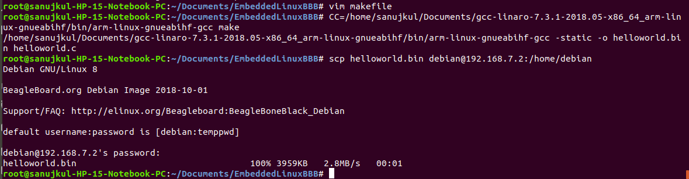
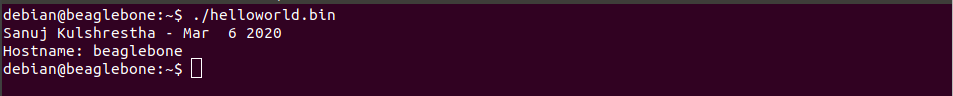

# gsoc-application

##### ExampleSanujKulshrestha is made for GSOC Application 2020 and is based on ExampleEntryJasonKridner with following changes:  
1. helloworld.c prints my name (hardcoded), date (__DATE__), and the name (gethostname()) of the host.  
2. cross compiler used is [arm-linux-gnueabihf-gcc](https://releases.linaro.org/components/toolchain/binaries/7.3-2018.05/arm-linux-gnueabihf/)  

### Steps followed -  
1. Created a helloworld.c file that prints my name, date and the hostname. Printing hostname to show that the output, when run on BBB, prints beaglebone.   
2. Created a makefile.  
3. Tranferred it to BeagleBone Black via scp command (scp filename hostname@IP:/address). 
  
4. Ran the output file on Beagleboneblack and verified that output is as expected.  

