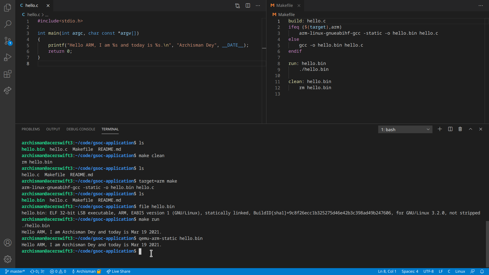

# Hello World cross-compiled for ARM

GSoC 2021 Application for BeagleBoard

## Install compiler toolchain and QEMU

On Kubuntu 20.04, run

    sudo apt-get install gcc-arm-linux-gnueabihf qemu-user-static

## Output

Text:

    archisman@acerswift3:~/code/gsoc-application$ ls
    hello.bin  hello.c  Makefile  README.md
    archisman@acerswift3:~/code/gsoc-application$ make clean
    rm hello.bin
    archisman@acerswift3:~/code/gsoc-application$ ls
    hello.c  Makefile  README.md
    archisman@acerswift3:~/code/gsoc-application$ target=arm make
    arm-linux-gnueabihf-gcc -static -o hello.bin hello.c
    archisman@acerswift3:~/code/gsoc-application$ ls
    hello.bin  hello.c  Makefile  README.md
    archisman@acerswift3:~/code/gsoc-application$ file hello.bin 
    hello.bin: ELF 32-bit LSB executable, ARM, EABI5 version 1 (GNU/Linux), statically linked, BuildID[sha1]=9c8f26ecc1b325275d46e42b3c398ad49b247606, for GNU/Linux 3.2.0, not stripped
    archisman@acerswift3:~/code/gsoc-application$ make run
    ./hello.bin
    Hello ARM, I am Archisman Dey and today is Mar 19 2021.
    archisman@acerswift3:~/code/gsoc-application$ qemu-arm-static hello.bin 
    Hello ARM, I am Archisman Dey and today is Mar 19 2021.
