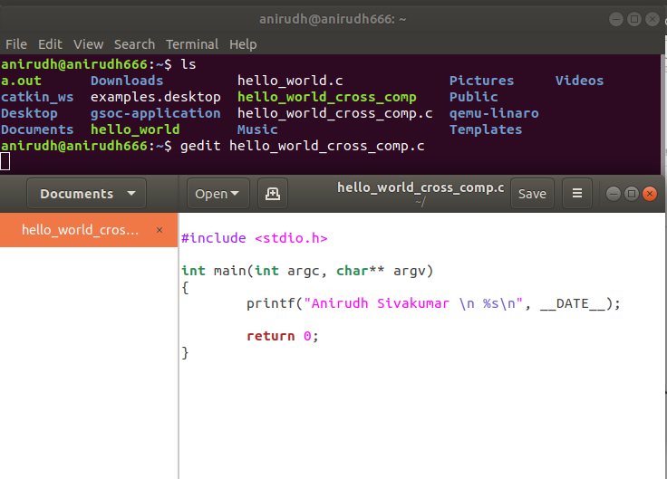

# gsoc-application
----
## 1. Create Hello World Program
- I used my ubuntu OS to write my C code.
- Using Gedit I wrote the Hello_world.c program.

Using gcc I compiled the program and executed it, using the commands :

`$ gcc hello_world.c -o hello_world`

`$ ./hello_world`

## 2. Cross Compiling Arm C code on Ubuntu

-   Installing the required softwares.

	- Installing Qemu.
	
      	`$ sudo apt-get install qemu`
	
	- Installing  arm tools and qemu-user-static packge.
	
      	`$ sudo apt-get install gcc-arm-linux-gnueabihf libc6-dev-armhf-cross qemu-user-static`
	
- Write the hello_world_cross_comp.c code in gedit.

- Compiling the code in amd64 directly:

    `$ arm-linux-gnueabihf-gcc -static -o hello_world_cross_comp hello_world_cross_comp.c`
    
-Running the code in binary.

    `$ qemu-arm-static hello_world_cross_comp hello_world_cross_comp`.
    
  or use .
  
    `$ qemu-aarch64 -L /usr/aarch64-linux-gnu/ [path-to-binary]`.
    
 

## 3. Creating the pull request

- Fork the original repository of jadonk from [here](https://github.com/jadonk/gsoc-application).

- Cloning it in ubuntu `$ git clone <your repo link>.`

- Create your new branch using command 
	`$ git checkout -b new_branch`

- Make all the changes required 
	
-Create a new remote for the upstream repository with the command
	`$ git remote add upstream https://github.com/kedark3/demo `
("upstream repo" refers to the original repository you created your fork from).

- Create the pull up request that pops up in your github repository.

-----

## References:

1. https://help.ubuntu.com/community/Installation/QemuEmulator
2. https://opensource.com/article/19/7/create-pull-request-github
3. https://gist.github.com/luk6xff/9f8d2520530a823944355e59343eadc1
4. https://www.suchprogramming.com/cross-compiling-c-code-for-arm/
5. https://github.com/jadonk/gsoc-application/blob/master/ExampleEntryJasonKridner/README.md

`
