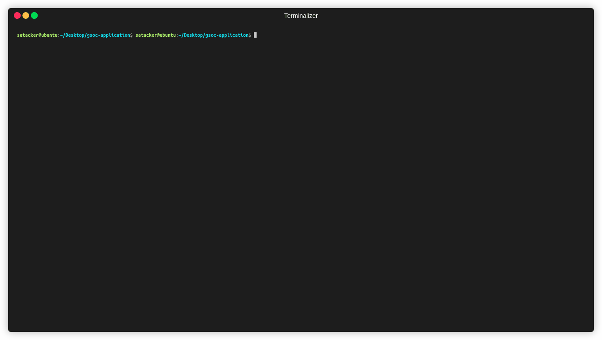

# GSoC 2021 Cross Compilation Task

## Qemu-arm-static
<html>
    <p align="center">
        <a href="#gif">
            
        </a>
    </p>
</html>

* Output

```sh
satacker@ubuntu:~/Desktop/gsoc-application$ qemu-arm-static ./helloworld.bin 
Shreyas Atre 
www.github.com\SAtacker
email : shreyasatre16@gmail.com
Mar 18 2021
System Name = Linux
Node Name = ubuntu
Version = #50~20.04.1-Ubuntu SMP Wed Feb 10 21:07:30 UTC 2021
Release = 5.8.0-44-generic
Machine = armv7l
```

## Samsung Exynos & Termux

<html>
    <p align="center">
        <a href="#gif">
            
        </a>
    </p>
</html>


## Pocketbeagle Output

<html>
    <p align="center">
        <a href="#gif">
            
        </a>
    </p>
</html>